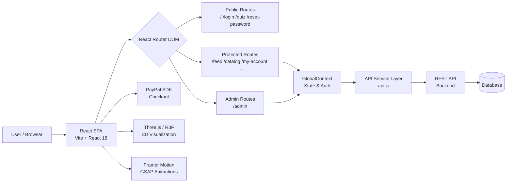

# Tu Selva Urbana

**Tu Selva Urbana** is a full-stack web application for plant enthusiasts — a social marketplace where users can discover, buy, sell, and share urban plants. The platform combines e-commerce functionality with a community-driven social feed, personalized plant recommendations, and an immersive 3D visualization experience.

**Repository:** [https://github.com/Desarrollo-Web-Profesional-Garay/tu_selva_urbana.git](https://github.com/Desarrollo-Web-Profesional-Garay/tu_selva_urbana.git)

---

## Table of Contents

- [Project Strengths](#project-strengths)
- [Improvement Opportunities](#improvement-opportunities)
- [Technology Stack](#technology-stack)
- [Architecture Diagram](#architecture-diagram)
- [Functional Requirements](#functional-requirements)
- [Getting Started](#getting-started)
- [Scripts](#scripts)
- [Project Structure](#project-structure)
- [Contributing](#contributing)
- [License](#license)

---

## Project Strengths

1. **Rich, Modern UI/UX** — The application leverages Framer Motion and GSAP for smooth animations, TailwindCSS for a consistent design system, and Lucide React for clean iconography, resulting in a polished, premium user experience.

2. **3D Plant Visualization** — Integration of `@react-three/fiber`, `@react-three/drei`, and `@google/model-viewer` allows users to explore plants in interactive 3D, setting the platform apart from conventional plant shops and significantly boosting engagement.

3. **Modular Component Architecture** — The codebase follows a clear separation of concerns with dedicated directories for pages, components, context, services, and data. This makes the project scalable and maintainable as the team grows.

4. **Integrated Payment Flow** — The inclusion of `@paypal/react-paypal-js` provides a real, production-ready checkout experience without requiring a custom payment backend, reducing complexity and time to market.

5. **Role-Based Access Control** — The application distinguishes between regular users and administrators via protected routes (`AdminRoute`), enabling a full admin panel for managing catalogs, orders, and users without exposing sensitive functionality to the public.

6. **Personalized Recommendation Engine** — The Quiz and Recommendations features guide users toward plants that match their lifestyle and environment, increasing conversion rates and user satisfaction through personalization.

7. **Chatbot & Plant Scanner** — Built-in AI-assisted features like the Chatbot and Scanner Modal demonstrate a forward-thinking approach to user support and engagement, reducing friction in the plant discovery journey.

---

## Improvement Opportunities

1. **Automated Testing Coverage** — The project currently lacks unit, integration, and end-to-end tests. Introducing Vitest (for unit/integration) and Playwright or Cypress (for E2E) would greatly improve reliability and confidence during future refactors.

2. **State Management Scalability** — The global state is managed via a custom React Context (`GlobalContext`). As the application grows in complexity, migrating to a more robust solution such as Zustand or Redux Toolkit would improve performance and developer experience (e.g., avoiding unnecessary re-renders).

3. **Accessibility (a11y) Compliance** — Ensuring all interactive elements have proper ARIA labels, keyboard navigation support, and sufficient color contrast ratios would make the platform inclusive for users with disabilities and improve SEO.

4. **Server-Side Rendering (SSR) or Static Generation** — The current Vite SPA setup is client-rendered, which can negatively impact SEO for plant catalog pages. Migrating to Next.js or adding a sitemap and prerendering strategy would improve organic search visibility.

5. **Error Handling & User Feedback** — While an `ErrorBoundary` exists, API errors and edge cases in forms are not always surfaced to the user in a friendly way. Implementing a global toast/notification system with clear error messages would significantly improve UX.

6. **Code Splitting & Performance Optimization** — Large page components (e.g., `CheckoutModal.jsx` at ~40KB) should be lazy-loaded using `React.lazy` and `Suspense` to reduce the initial bundle size and improve page load times.

7. **Environment Variable Management** — Sensitive keys and API endpoints should be strictly managed via `.env` files and never committed to version control. A documented `.env.example` file should be added to guide contributors.

---

## Technology Stack

| Category            | Technology                  | Version    | Purpose                                      |
|---------------------|-----------------------------|------------|----------------------------------------------|
| UI Framework        | React                       | ^18.2.0    | Component-based user interface               |
| Bundler             | Vite                        | ^5.2.0     | Fast development server and production build |
| Routing             | React Router DOM            | ^6.22.3    | Client-side navigation and protected routes  |
| Styling             | Tailwind CSS                | ^3.4.1     | Utility-first CSS design system              |
| Animations          | Framer Motion               | ^11.0.8    | Declarative UI animations and transitions    |
| Animations          | GSAP                        | ^3.14.2    | High-performance timeline animations         |
| 3D Rendering        | Three.js                    | ^0.160.0   | WebGL-powered 3D graphics                    |
| 3D Rendering        | @react-three/fiber          | ^8.15.12   | React renderer for Three.js scenes           |
| 3D Rendering        | @react-three/drei           | ^9.96.1    | Helpers and abstractions for R3F             |
| 3D Viewer           | @google/model-viewer        | ^4.0.0     | Embeddable 3D model viewer (AR-ready)        |
| Payments            | @paypal/react-paypal-js     | ^9.1.0     | PayPal checkout integration                  |
| Icons               | Lucide React                | ^0.358.0   | Consistent SVG icon library                  |
| PostCSS             | PostCSS + Autoprefixer      | ^8.4.38    | CSS transformation and browser compatibility |
| Static Server       | serve                       | ^14.2.6    | Production static file serving               |

---

## Architecture Diagram



---

## Functional Requirements

| ID     | Requirement                                                                                                          |
|--------|----------------------------------------------------------------------------------------------------------------------|
| RF-01  | The system shall allow users to register with email and password.                                                    |
| RF-02  | The system shall allow users to authenticate and maintain a session securely.                                        |
| RF-03  | The system shall allow users to reset their password via an email verification link.                                 |
| RF-04  | The system shall display a personalized plant recommendation quiz and store user preferences.                        |
| RF-05  | The system shall allow authenticated users to browse a paginated plant catalog with filters by category and price.  |
| RF-06  | The system shall allow authenticated users to add plants to a shopping cart and complete checkout via PayPal.        |
| RF-07  | The system shall allow authenticated users to publish plant listings for sale, including photos and descriptions.    |
| RF-08  | The system shall allow authenticated users to manage their own plant collection (My Plants section).                 |
| RF-09  | The system shall display a social feed where users can create, view, and comment on plant-related posts.             |
| RF-10  | The system shall allow users to view plant details, including a 3D interactive model when available.                 |
| RF-11  | The system shall allow users to edit their profile, including name, avatar, and personal preferences.                |
| RF-12  | The system shall allow administrators to manage the product catalog (create, edit, and delete plant listings).       |
| RF-13  | The system shall allow administrators to view, manage, and update the status of customer orders.                     |
| RF-14  | The system shall allow administrators to view and manage registered user accounts.                                   |
| RF-15  | The system shall provide a chatbot assistant to help users find plants and navigate the platform.                    |

---

## Getting Started

### Prerequisites

- [Node.js](https://nodejs.org/) v18 or higher
- npm v9 or higher
- Git

### Installation

```bash
# 1. Clone the repository
git clone https://github.com/Desarrollo-Web-Profesional-Garay/tu_selva_urbana.git

# 2. Navigate into the project folder
cd tu-selva-urbana-react

# 3. Install dependencies
npm install

# 4. Start the development server
npm run dev
```

The application will be available at `http://localhost:5173`.

---

## Scripts

| Command           | Description                                    |
|-------------------|------------------------------------------------|
| `npm run dev`     | Start the local development server (with host) |
| `npm run build`   | Build the production bundle to `dist/`         |
| `npm run preview` | Preview the production build locally            |
| `npm start`       | Serve the `dist/` folder via static server      |

---

## Project Structure

```
tu-selva-urbana-react/
├── public/                  # Static assets
├── src/
│   ├── components/          # Reusable UI components
│   │   ├── 3d/              # Three.js / R3F scene components
│   │   ├── Layout.jsx       # Main app shell with navigation
│   │   ├── CartDrawer.jsx   # Shopping cart sidebar
│   │   ├── CheckoutModal.jsx
│   │   ├── Chatbot.jsx
│   │   ├── AdminRoute.jsx   # Role-based route guard
│   │   └── ...
│   ├── pages/               # Route-level page components
│   │   ├── LandingPage.jsx
│   │   ├── Login.jsx
│   │   ├── Catalog.jsx
│   │   ├── Feed.jsx
│   │   ├── Quiz.jsx
│   │   ├── AdminPanel.jsx
│   │   └── ...
│   ├── context/
│   │   └── GlobalContext.jsx # Global state and auth context
│   ├── services/
│   │   └── api.js           # API abstraction layer
│   ├── data/                # Static / seed data
│   ├── App.jsx              # Route definitions
│   ├── main.jsx             # Application entry point
│   └── index.css            # Global styles
├── index.html               # HTML entry point
├── vite.config.js           # Vite configuration
├── tailwind.config.js       # Tailwind CSS configuration
└── package.json
```

---

## Contributing

1. Fork the repository.
2. Create a new branch from `main`:
   ```bash
   git checkout -b dev
   ```
3. Make your changes and commit following conventional commits:
   ```bash
   git commit -m "feat: add new feature"
   ```
4. Push your branch:
   ```bash
   git push origin dev
   ```
5. Open a Pull Request targeting the `main` branch of the original repository.

---

## License

This project is developed as part of an academic team project at **Desarrollo Web Profesional Garay**. All rights reserved by the respective contributors.
