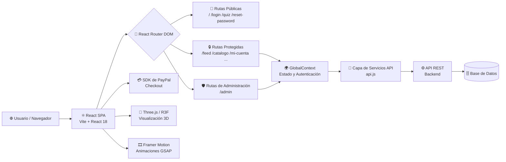
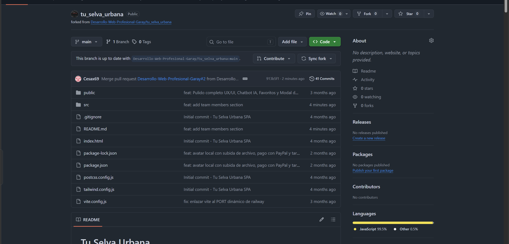
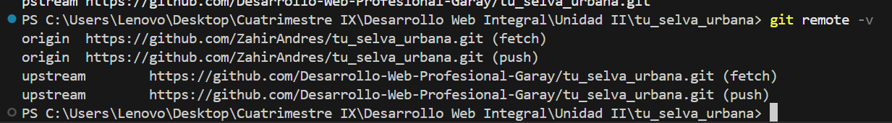
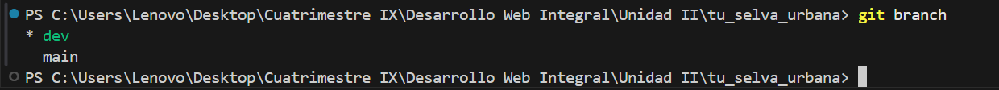
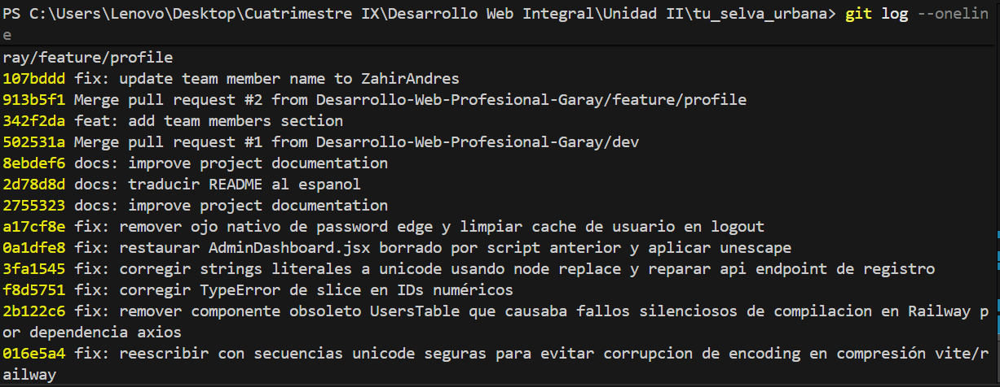
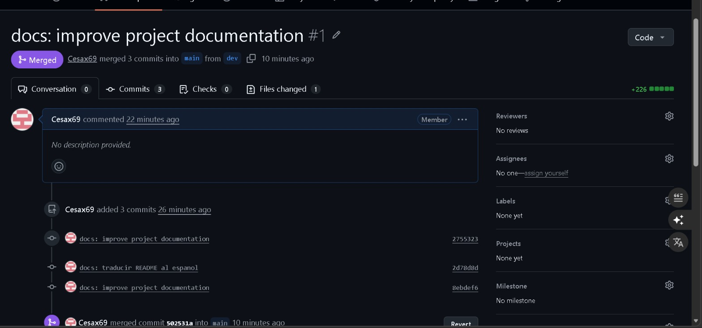
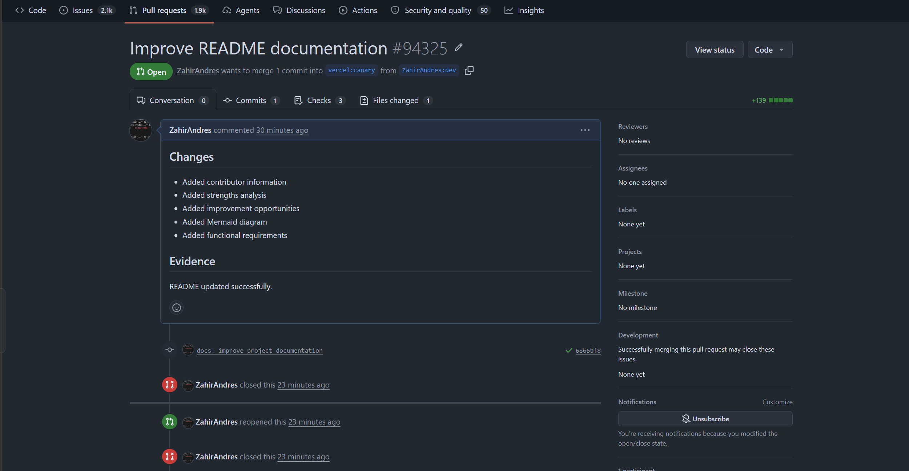

<div align="center">


<br/>

<p>
  
  
  
  
  
</p>

<p>
  
  
  
  
</p>

<br/>

> **Tu Selva Urbana** es una plataforma web de pila completa para amantes de las plantas — un mercado social donde los usuarios pueden descubrir, comprar, vender y compartir plantas urbanas. Combina comercio electrónico con un feed social comunitario, recomendaciones personalizadas y visualización 3D inmersiva.

<br/>

**🔗 Repositorio:** [github.com/Desarrollo-Web-Profesional-Garay/tu_selva_urbana](https://github.com/Desarrollo-Web-Profesional-Garay/tu_selva_urbana.git)

</div>

---

## 📋 Tabla de Contenidos

<details>
<summary><b>Ver índice completo</b></summary>

- [✨ Fortalezas del Proyecto](#-fortalezas-del-proyecto)
- [🔧 Áreas de Mejora](#-áreas-de-mejora)
- [🛠️ Tecnologías Utilizadas](#️-tecnologías-utilizadas)
- [🏗️ Diagrama de Arquitectura](#️-diagrama-de-arquitectura)
- [📄 Requerimientos Funcionales](#-requerimientos-funcionales)
- [🚀 Primeros Pasos](#-primeros-pasos)
- [📜 Scripts Disponibles](#-scripts-disponibles)
- [📁 Estructura del Proyecto](#-estructura-del-proyecto)
- [👥 Equipo de Desarrollo](#-equipo-de-desarrollo)
- [🤝 Contribuir](#-contribuir)
- [🖼️ Evidencias](#️-evidencias)
- [📄 Licencia](#-licencia)

</details>

---

## ✨ Fortalezas del Proyecto

<table>
  <tr>
    <td width="50px" align="center">🎨</td>
    <td><b>Interfaz de Usuario Rica y Moderna</b><br/>La aplicación aprovecha <em>Framer Motion</em> y <em>GSAP</em> para animaciones fluidas, TailwindCSS para un sistema de diseño consistente y Lucide React para iconografía limpia, resultando en una experiencia de usuario pulida y de alto nivel.</td>
  </tr>
  <tr>
    <td align="center">🌱</td>
    <td><b>Visualización 3D de Plantas</b><br/>Integración de <code>@react-three/fiber</code>, <code>@react-three/drei</code> y <code>@google/model-viewer</code> que permite explorar plantas en 3D interactivo, diferenciando la plataforma de tiendas convencionales y aumentando el engagement.</td>
  </tr>
  <tr>
    <td align="center">🧩</td>
    <td><b>Arquitectura de Componentes Modular</b><br/>Clara separación de responsabilidades con directorios dedicados para páginas, componentes, contexto, servicios y datos. Escalable y mantenible a medida que el equipo crece.</td>
  </tr>
  <tr>
    <td align="center">💳</td>
    <td><b>Flujo de Pago Integrado</b><br/>Inclusión de <code>@paypal/react-paypal-js</code> que proporciona una experiencia de pago real y lista para producción, reduciendo la complejidad y el tiempo de puesta en marcha.</td>
  </tr>
  <tr>
    <td align="center">🔐</td>
    <td><b>Control de Acceso Basado en Roles</b><br/>La aplicación distingue entre usuarios regulares y administradores mediante rutas protegidas (<code>AdminRoute</code>), habilitando un panel de administración completo sin exponer funcionalidades sensibles.</td>
  </tr>
  <tr>
    <td align="center">🤖</td>
    <td><b>Motor de Recomendaciones Personalizadas</b><br/>Las funciones de Quiz y Recomendaciones guían a los usuarios hacia las plantas que se adaptan a su estilo de vida, aumentando tasas de conversión y satisfacción mediante personalización.</td>
  </tr>
  <tr>
    <td align="center">💬</td>
    <td><b>Chatbot y Escáner de Plantas con IA</b><br/>Funciones asistidas por inteligencia artificial que demuestran un enfoque vanguardista en el soporte al usuario, reduciendo la fricción en el proceso de descubrimiento de plantas.</td>
  </tr>
</table>

---

## 🔧 Áreas de Mejora

<table>
  <tr>
    <td width="50px" align="center">🧪</td>
    <td><b>Cobertura de Pruebas Automatizadas</b><br/>El proyecto actualmente carece de pruebas unitarias, de integración y E2E. Introducir <em>Vitest</em> y <em>Playwright</em> mejoraría considerablemente la confiabilidad en futuros refactors.</td>
  </tr>
  <tr>
    <td align="center">📦</td>
    <td><b>Escalabilidad del Manejo de Estado</b><br/>El estado global se gestiona mediante <code>GlobalContext</code>. Migrar a <em>Zustand</em> o <em>Redux Toolkit</em> mejoraría el rendimiento y la experiencia del desarrollador evitando re-renders innecesarios.</td>
  </tr>
  <tr>
    <td align="center">♿</td>
    <td><b>Cumplimiento de Accesibilidad (a11y)</b><br/>Asegurar etiquetas ARIA, soporte de teclado y contraste de colores suficiente haría la plataforma inclusiva para usuarios con discapacidades y mejoraría el SEO.</td>
  </tr>
  <tr>
    <td align="center">⚡</td>
    <td><b>Renderizado del Lado del Servidor (SSR)</b><br/>La configuración actual como SPA afecta el SEO de las páginas del catálogo. Migrar a <em>Next.js</em> o agregar prerenderizado mejoraría la visibilidad en búsquedas orgánicas.</td>
  </tr>
  <tr>
    <td align="center">🚨</td>
    <td><b>Manejo de Errores y Retroalimentación</b><br/>Implementar un sistema global de notificaciones/toasts con mensajes de error claros mejoraría significativamente la experiencia cuando fallan llamadas a la API.</td>
  </tr>
  <tr>
    <td align="center">✂️</td>
    <td><b>División de Código y Optimización</b><br/>Componentes de gran tamaño como <code>CheckoutModal.jsx</code> (~40KB) deberían cargarse de forma diferida con <code>React.lazy</code> y <code>Suspense</code> para reducir el bundle inicial.</td>
  </tr>
  <tr>
    <td align="center">🔑</td>
    <td><b>Gestión de Variables de Entorno</b><br/>Las claves sensibles y endpoints deben gestionarse mediante archivos <code>.env</code> y nunca confirmarse en el control de versiones. Se debe agregar un <code>.env.example</code> documentado.</td>
  </tr>
</table>

---

## 🛠️ Tecnologías Utilizadas

<div align="center">

| Categoría | Tecnología | Versión | Propósito |
|:---:|:---:|:---:|:---|
| ⚛️ Framework UI | React | `^18.2.0` | Interfaz de usuario basada en componentes |
| ⚡ Empaquetador | Vite | `^5.2.0` | Servidor de desarrollo rápido y compilación |
| 🧭 Enrutamiento | React Router DOM | `^6.22.3` | Navegación del lado del cliente y rutas protegidas |
| 🎨 Estilos | Tailwind CSS | `^3.4.1` | Sistema de diseño basado en utilidades CSS |
| 🎞️ Animaciones | Framer Motion | `^11.0.8` | Animaciones declarativas de UI y transiciones |
| 🎬 Animaciones | GSAP | `^3.14.2` | Animaciones de timeline de alto rendimiento |
| 🧊 Renderizado 3D | Three.js | `^0.160.0` | Gráficos 3D acelerados por WebGL |
| 🧊 Renderizado 3D | @react-three/fiber | `^8.15.12` | Renderizador React para escenas Three.js |
| 🧊 Renderizado 3D | @react-three/drei | `^9.96.1` | Helpers y abstracciones para R3F |
| 👁️ Visor 3D | @google/model-viewer | `^4.0.0` | Visor de modelos 3D embebible (compatible AR) |
| 💳 Pagos | @paypal/react-paypal-js | `^9.1.0` | Integración de pago con PayPal |
| 🖼️ Íconos | Lucide React | `^0.358.0` | Biblioteca de íconos SVG consistentes |
| 🔧 PostCSS | PostCSS + Autoprefixer | `^8.4.38` | Transformación CSS y compatibilidad |
| 🌐 Servidor Estático | serve | `^14.2.6` | Archivos estáticos en producción |

</div>

---

## 🏗️ Diagrama de Arquitectura



---

## 📄 Requerimientos Funcionales

<div align="center">

| ID | Requerimiento |
|:---:|:---|
| `RF-01` | El sistema deberá permitir el **registro de usuarios** con correo electrónico y contraseña. |
| `RF-02` | El sistema deberá permitir la **autenticación de usuarios** y el mantenimiento de una sesión de forma segura. |
| `RF-03` | El sistema deberá permitir a los usuarios **restablecer su contraseña** mediante un enlace de verificación por correo. |
| `RF-04` | El sistema deberá mostrar un **quiz personalizado** de recomendación de plantas y almacenar las preferencias del usuario. |
| `RF-05` | El sistema deberá permitir **navegar por un catálogo paginado** con filtros por categoría y precio. |
| `RF-06` | El sistema deberá permitir **agregar plantas al carrito** y completar el pago mediante PayPal. |
| `RF-07` | El sistema deberá permitir **publicar anuncios de venta** de plantas con fotos y descripción. |
| `RF-08` | El sistema deberá permitir gestionar la **colección personal de plantas** (sección Mis Plantas). |
| `RF-09` | El sistema deberá mostrar un **feed social** donde los usuarios puedan crear, ver y comentar publicaciones. |
| `RF-10` | El sistema deberá permitir ver el **detalle de una planta**, incluyendo un modelo 3D interactivo si disponible. |
| `RF-11` | El sistema deberá permitir **editar el perfil** del usuario, incluyendo nombre, avatar y preferencias. |
| `RF-12` | El sistema deberá permitir a los administradores **gestionar el catálogo** de productos (CRUD de plantas). |
| `RF-13` | El sistema deberá permitir a los administradores **gestionar pedidos** y actualizar su estado. |
| `RF-14` | El sistema deberá permitir a los administradores **gestionar cuentas de usuarios** registrados. |
| `RF-15` | El sistema deberá proporcionar un **asistente chatbot** para ayudar a los usuarios a encontrar plantas y navegar la plataforma. |

</div>

---

## 🚀 Primeros Pasos

### 📋 Requisitos Previos

> Asegúrate de tener instalado lo siguiente antes de comenzar:

-  **Node.js** v18 o superior
-  **npm** v9 o superior
-  **Git**

### ⚙️ Instalación

```bash
# 1. Clonar el repositorio
git clone https://github.com/Desarrollo-Web-Profesional-Garay/tu_selva_urbana.git

# 2. Entrar a la carpeta del proyecto
cd tu-selva-urbana-react

# 3. Instalar dependencias
npm install

# 4. Iniciar el servidor de desarrollo
npm run dev
```

> 🌐 La aplicación estará disponible en **`http://localhost:5173`**

---

## 📜 Scripts Disponibles

<div align="center">

| Comando | Descripción |
|:---:|:---|
| `npm run dev` | 🔥 Inicia el servidor de desarrollo local (con host) |
| `npm run build` | 📦 Compila el bundle de producción en la carpeta `dist/` |
| `npm run preview` | 👁️ Previsualiza el build de producción localmente |
| `npm start` | 🌐 Sirve la carpeta `dist/` mediante un servidor estático |

</div>

---

## 📁 Estructura del Proyecto

```
tu-selva-urbana-react/
│
├── 📂 public/                  # Recursos estáticos (imágenes, íconos)
│
├── 📂 src/
│   ├── 📂 components/          # Componentes UI reutilizables
│   │   ├── 📂 3d/              # Escenas Three.js / R3F
│   │   ├── Layout.jsx          # Shell principal con navegación
│   │   ├── CartDrawer.jsx      # Barra lateral del carrito
│   │   ├── CheckoutModal.jsx   # Modal de pago
│   │   ├── Chatbot.jsx         # Asistente IA
│   │   ├── AdminRoute.jsx      # Guardia de ruta por rol
│   │   └── ...
│   │
│   ├── 📂 pages/               # Componentes a nivel de ruta
│   │   ├── LandingPage.jsx
│   │   ├── Login.jsx
│   │   ├── Catalog.jsx
│   │   ├── Feed.jsx
│   │   ├── Quiz.jsx
│   │   ├── AdminPanel.jsx
│   │   └── ...
│   │
│   ├── 📂 context/
│   │   └── GlobalContext.jsx   # Estado global y autenticación
│   │
│   ├── 📂 services/
│   │   └── api.js              # Capa de abstracción de la API
│   │
│   ├── 📂 data/                # Datos estáticos / semilla
│   ├── App.jsx                 # Definición de rutas
│   ├── main.jsx                # Punto de entrada de la aplicación
│   └── index.css               # Estilos globales
│
├── index.html                  # Punto de entrada HTML
├── vite.config.js              # Configuración de Vite
├── tailwind.config.js          # Configuración de Tailwind CSS
└── package.json
```

---

## 👥 Equipo de Desarrollo

<div align="center">

<table>
  <thead>
    <tr>
      <th align="center">👤 Integrante</th>
      <th align="center">🎓 Rol en el Equipo</th>
      <th align="center">🔗 GitHub</th>
      <th align="center">🛠️ Área de Contribución</th>
    </tr>
  </thead>
  <tbody>
    <tr>
      <td align="center"><b>ZahirAndres</b></td>
      <td align="center">Desarrollador Frontend</td>
      <td align="center">
        <a href="https://github.com/Desarrollo-Web-Profesional-Garay">
          
        </a>
      </td>
      <td align="center">Interfaz de usuario, componentes React, rama <code>Front-ZahirAndres</code></td>
    </tr>
    <tr>
      <td align="center"><b>César</b></td>
      <td align="center">Desarrollador Full Stack</td>
      <td align="center">
        <a href="https://github.com/Desarrollo-Web-Profesional-Garay">
          
        </a>
      </td>
      <td align="center">Integración 3D, animaciones, flujo de pagos, documentación</td>
    </tr>
    <tr>
      <td align="center"><b>Equipo Backend</b></td>
      <td align="center">Desarrollador Backend</td>
      <td align="center">
        <a href="https://github.com/Desarrollo-Web-Profesional-Garay">
          
        </a>
      </td>
      <td align="center">API REST, base de datos, autenticación, rama <code>backend</code></td>
    </tr>
  </tbody>
</table>

<br/>

### 🧰 Tecnologías dominadas por el equipo

<br/>


</div>

---

## 🤝 Contribuir

¡Las contribuciones son bienvenidas! Por favor sigue estos pasos:

```bash
# 1. Haz un fork del repositorio y clónalo localmente
git clone https://github.com/TU_USUARIO/tu_selva_urbana.git

# 2. Crea una nueva rama a partir de main
git checkout -b feat/nueva-funcionalidad

# 3. Realiza tus cambios y haz commit (Conventional Commits)
git commit -m "feat: agregar nueva funcionalidad"

# 4. Sube tu rama
git push origin feat/nueva-funcionalidad
```

5. Abre un **Pull Request** apuntando a la rama `main` del repositorio original. 🎉

> **Tip:** Usa el prefijo `feat:`, `fix:`, `docs:`, `chore:` en tus commits para seguir el estándar de [Conventional Commits](https://www.conventionalcommits.org/es/v1.0.0/).

---

## 🖼️ Evidencias

<details>
<summary><b>📸 Ver capturas de pantalla del proyecto</b></summary>

<br/>

### Evidencia 1


---

### Evidencia 2


---

### Evidencia 3


---

### Evidencia 4


---

### Evidencia 5 — Trabajo en Equipo


### Evidencia 5 — Trabajo Individual


</details>

---

### Evidencia 6 — Pull Requests

<div align="center">

| Tipo | Enlace |
|:---:|:---|
| 🤝 Trabajo en equipo | [PR #1 — tu_selva_urbana](https://github.com/Desarrollo-Web-Profesional-Garay/tu_selva_urbana/pull/1) |
| 👤 Trabajo individual | [PR #94325 — vercel/next.js](https://github.com/vercel/next.js/pull/94325) |

</div>

---

## 📄 Licencia

<div align="center">

Este proyecto se desarrolla como parte de un proyecto académico en **Desarrollo Web Profesional Garay**.  
Todos los derechos reservados por los respectivos colaboradores.

<br/>


<br/><br/>

*Hecho con 🌿 y mucho ☕ por el equipo de Desarrollo Web Profesional Garay*

</div>
