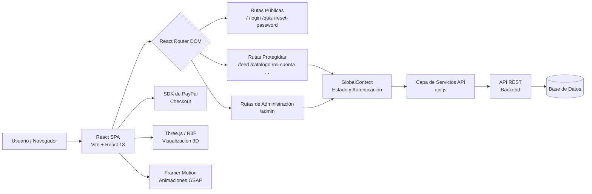

# Tu Selva Urbana

**Tu Selva Urbana** es una aplicación web de pila completa para amantes de las plantas — un mercado social donde los usuarios pueden descubrir, comprar, vender y compartir plantas urbanas. La plataforma combina funcionalidades de comercio electrónico con un feed social comunitario, recomendaciones personalizadas de plantas y una experiencia inmersiva de visualización 3D.

**Repositorio:** [https://github.com/Desarrollo-Web-Profesional-Garay/tu_selva_urbana.git](https://github.com/Desarrollo-Web-Profesional-Garay/tu_selva_urbana.git)

---

## Tabla de Contenidos

- [Project Strengths](#project-strengths)
- [Improvement Opportunities](#improvement-opportunities)
- [Tecnologías Utilizadas](#tecnologías-utilizadas)
- [Diagrama de Arquitectura](#diagrama-de-arquitectura)
- [Requerimientos Funcionales](#requerimientos-funcionales)
- [Primeros Pasos](#primeros-pasos)
- [Scripts Disponibles](#scripts-disponibles)
- [Estructura del Proyecto](#estructura-del-proyecto)
- [Equipo de Desarrollo](#equipo-de-desarrollo)
- [Contribuir](#contribuir)
- [Licencia](#licencia)

---

## Project Strengths

1. **Interfaz de Usuario Rica y Moderna** — La aplicación aprovecha Framer Motion y GSAP para animaciones fluidas, TailwindCSS para un sistema de diseño consistente y Lucide React para una iconografía limpia, lo que resulta en una experiencia de usuario pulida y de alto nivel.

2. **Visualización 3D de Plantas** — La integración de `@react-three/fiber`, `@react-three/drei` y `@google/model-viewer` permite a los usuarios explorar plantas en 3D interactivo, diferenciando la plataforma de las tiendas de plantas convencionales y aumentando significativamente el nivel de engagement.

3. **Arquitectura de Componentes Modular** — El código sigue una clara separación de responsabilidades con directorios dedicados para páginas, componentes, contexto, servicios y datos. Esto hace que el proyecto sea escalable y mantenible a medida que el equipo crece.

4. **Flujo de Pago Integrado** — La inclusión de `@paypal/react-paypal-js` proporciona una experiencia de pago real y lista para producción sin necesidad de un backend de pagos personalizado, reduciendo la complejidad y el tiempo de puesta en marcha.

5. **Control de Acceso Basado en Roles** — La aplicación distingue entre usuarios regulares y administradores mediante rutas protegidas (`AdminRoute`), habilitando un panel de administración completo para gestionar catálogos, pedidos y usuarios sin exponer funcionalidades sensibles al público.

6. **Motor de Recomendaciones Personalizadas** — Las funciones de Quiz y Recomendaciones guían a los usuarios hacia las plantas que se adaptan a su estilo de vida y entorno, aumentando las tasas de conversión y la satisfacción del usuario mediante la personalización.

7. **Chatbot y Escáner de Plantas** — Las funciones asistidas por inteligencia artificial, como el Chatbot y el Modal de Escáner, demuestran un enfoque vanguardista en el soporte al usuario y el engagement, reduciendo la fricción en el proceso de descubrimiento de plantas.

---

## Improvement Opportunities

1. **Cobertura de Pruebas Automatizadas** — El proyecto actualmente carece de pruebas unitarias, de integración y de extremo a extremo. Introducir Vitest (para unitarias/integración) y Playwright o Cypress (para E2E) mejoraría considerablemente la confiabilidad y la seguridad durante futuros refactors.

2. **Escalabilidad del Manejo de Estado** — El estado global se gestiona mediante un Context personalizado de React (`GlobalContext`). A medida que la aplicación crece en complejidad, migrar a una solución más robusta como Zustand o Redux Toolkit mejoraría el rendimiento y la experiencia del desarrollador (evitando re-renders innecesarios).

3. **Cumplimiento de Accesibilidad (a11y)** — Asegurarse de que todos los elementos interactivos tengan etiquetas ARIA adecuadas, soporte de navegación por teclado y suficiente contraste de colores haría la plataforma inclusiva para usuarios con discapacidades y mejoraría el SEO.

4. **Renderizado del Lado del Servidor (SSR) o Generación Estática** — La configuración actual de Vite como SPA se renderiza en el cliente, lo que puede afectar negativamente el SEO de las páginas del catálogo. Migrar a Next.js o agregar un mapa del sitio y una estrategia de prerenderizado mejoraría la visibilidad en búsquedas orgánicas.

5. **Manejo de Errores y Retroalimentación al Usuario** — Aunque existe un `ErrorBoundary`, los errores de API y los casos extremos en los formularios no siempre se muestran al usuario de forma amigable. Implementar un sistema global de notificaciones/toasts con mensajes de error claros mejoraría significativamente la experiencia de usuario.

6. **División de Código y Optimización de Rendimiento** — Los componentes de página de gran tamaño (como `CheckoutModal.jsx` con ~40KB) deberían cargarse de forma diferida usando `React.lazy` y `Suspense` para reducir el tamaño del bundle inicial y mejorar los tiempos de carga.

7. **Gestión de Variables de Entorno** — Las claves sensibles y los endpoints de la API deben gestionarse estrictamente mediante archivos `.env` y nunca deben ser confirmados en el control de versiones. Se debe agregar un archivo `.env.example` documentado para guiar a los colaboradores.

---

## Tecnologías Utilizadas

| Categoría           | Tecnología                  | Versión    | Propósito                                              |
|---------------------|-----------------------------|------------|--------------------------------------------------------|
| Framework UI        | React                       | ^18.2.0    | Interfaz de usuario basada en componentes              |
| Empaquetador        | Vite                        | ^5.2.0     | Servidor de desarrollo rápido y compilación en prod    |
| Enrutamiento        | React Router DOM            | ^6.22.3    | Navegación del lado del cliente y rutas protegidas     |
| Estilos             | Tailwind CSS                | ^3.4.1     | Sistema de diseño basado en utilidades CSS             |
| Animaciones         | Framer Motion               | ^11.0.8    | Animaciones declarativas de UI y transiciones          |
| Animaciones         | GSAP                        | ^3.14.2    | Animaciones de línea de tiempo de alto rendimiento     |
| Renderizado 3D      | Three.js                    | ^0.160.0   | Gráficos 3D acelerados por WebGL                       |
| Renderizado 3D      | @react-three/fiber          | ^8.15.12   | Renderizador React para escenas Three.js               |
| Renderizado 3D      | @react-three/drei           | ^9.96.1    | Ayudantes y abstracciones para R3F                     |
| Visor 3D            | @google/model-viewer        | ^4.0.0     | Visor de modelos 3D embebible (compatible con AR)      |
| Pagos               | @paypal/react-paypal-js     | ^9.1.0     | Integración de pago con PayPal                         |
| Íconos              | Lucide React                | ^0.358.0   | Biblioteca de íconos SVG consistentes                  |
| PostCSS             | PostCSS + Autoprefixer      | ^8.4.38    | Transformación CSS y compatibilidad con navegadores    |
| Servidor Estático   | serve                       | ^14.2.6    | Servicio de archivos estáticos en producción           |

---

## Diagrama de Arquitectura



---

## Requerimientos Funcionales

| ID     | Requerimiento                                                                                                              |
|--------|----------------------------------------------------------------------------------------------------------------------------|
| RF-01  | El sistema deberá permitir el registro de usuarios con correo electrónico y contraseña.                                    |
| RF-02  | El sistema deberá permitir la autenticación de usuarios y el mantenimiento de una sesión de forma segura.                  |
| RF-03  | El sistema deberá permitir a los usuarios restablecer su contraseña mediante un enlace de verificación por correo.         |
| RF-04  | El sistema deberá mostrar un quiz personalizado de recomendación de plantas y almacenar las preferencias del usuario.      |
| RF-05  | El sistema deberá permitir a los usuarios autenticados navegar por un catálogo paginado con filtros por categoría y precio.|
| RF-06  | El sistema deberá permitir a los usuarios autenticados agregar plantas al carrito y completar el pago mediante PayPal.     |
| RF-07  | El sistema deberá permitir a los usuarios autenticados publicar anuncios de venta de plantas con fotos y descripción.      |
| RF-08  | El sistema deberá permitir a los usuarios autenticados gestionar su propia colección de plantas (sección Mis Plantas).     |
| RF-09  | El sistema deberá mostrar un feed social donde los usuarios puedan crear, ver y comentar publicaciones sobre plantas.      |
| RF-10  | El sistema deberá permitir a los usuarios ver el detalle de una planta, incluyendo un modelo 3D interactivo si disponible. |
| RF-11  | El sistema deberá permitir a los usuarios editar su perfil, incluyendo nombre, avatar y preferencias personales.           |
| RF-12  | El sistema deberá permitir a los administradores gestionar el catálogo de productos (crear, editar y eliminar plantas).    |
| RF-13  | El sistema deberá permitir a los administradores ver, gestionar y actualizar el estado de los pedidos de los clientes.     |
| RF-14  | El sistema deberá permitir a los administradores ver y gestionar las cuentas de usuarios registrados.                      |
| RF-15  | El sistema deberá proporcionar un asistente chatbot para ayudar a los usuarios a encontrar plantas y navegar la plataforma.|

---

## Primeros Pasos

### Requisitos Previos

- [Node.js](https://nodejs.org/) v18 o superior
- npm v9 o superior
- Git

### Instalación

```bash
# 1. Clonar el repositorio
git clone https://github.com/Desarrollo-Web-Profesional-Garay/tu_selva_urbana.git

# 2. Entrar a la carpeta del proyecto
cd tu-selva-urbana-react

# 3. Instalar dependencias
npm install

# 4. Iniciar el servidor de desarrollo
npm run dev
```

La aplicación estará disponible en `http://localhost:5173`.

---

## Scripts Disponibles

| Comando           | Descripción                                              |
|-------------------|----------------------------------------------------------|
| `npm run dev`     | Inicia el servidor de desarrollo local (con host)        |
| `npm run build`   | Compila el bundle de producción en la carpeta `dist/`    |
| `npm run preview` | Previsualiza el build de producción localmente           |
| `npm start`       | Sirve la carpeta `dist/` mediante un servidor estático   |

---

## Estructura del Proyecto

```
tu-selva-urbana-react/
├── public/                  # Recursos estáticos
├── src/
│   ├── components/          # Componentes UI reutilizables
│   │   ├── 3d/              # Componentes de escena Three.js / R3F
│   │   ├── Layout.jsx       # Shell principal de la app con navegación
│   │   ├── CartDrawer.jsx   # Barra lateral del carrito de compras
│   │   ├── CheckoutModal.jsx
│   │   ├── Chatbot.jsx
│   │   ├── AdminRoute.jsx   # Guardia de ruta basada en roles
│   │   └── ...
│   ├── pages/               # Componentes de página a nivel de ruta
│   │   ├── LandingPage.jsx
│   │   ├── Login.jsx
│   │   ├── Catalog.jsx
│   │   ├── Feed.jsx
│   │   ├── Quiz.jsx
│   │   ├── AdminPanel.jsx
│   │   └── ...
│   ├── context/
│   │   └── GlobalContext.jsx # Estado global y contexto de autenticación
│   ├── services/
│   │   └── api.js           # Capa de abstracción de la API
│   ├── data/                # Datos estáticos / semilla
│   ├── App.jsx              # Definición de rutas
│   ├── main.jsx             # Punto de entrada de la aplicación
│   └── index.css            # Estilos globales
├── index.html               # Punto de entrada HTML
├── vite.config.js           # Configuración de Vite
├── tailwind.config.js       # Configuración de Tailwind CSS
└── package.json
```

---

## Contribuir

1. Haz un fork del repositorio.
2. Crea una nueva rama a partir de `main`:
   ```bash
   git checkout -b dev
   ```
3. Realiza tus cambios y haz commit siguiendo commits convencionales:
   ```bash
   git commit -m "feat: agregar nueva funcionalidad"
   ```
4. Sube tu rama:
   ```bash
   git push origin dev
   ```
5. Abre un Pull Request apuntando a la rama `main` del repositorio original.

---

## Team Members

<br>

<div align="center">

<table>
  <thead>
    <tr>
      <th align="center">👤 Integrante</th>
      <th align="center">🎓 Rol en el Equipo</th>
      <th align="center">🔗 GitHub</th>
      <th align="center">🛠️ Área de Contribución</th>
    </tr>
  </thead>
  <tbody>
    <tr>
      <td align="center">
        <b>Ángel</b>
      </td>
      <td align="center">Desarrollador Frontend</td>
      <td align="center">
        <a href="https://github.com/Desarrollo-Web-Profesional-Garay">
          
        </a>
      </td>
      <td align="center">Interfaz de usuario, componentes React, rama <code>Front-Angel</code></td>
    </tr>
    <tr>
      <td align="center">
        <b>César</b>
      </td>
      <td align="center">Desarrollador Full Stack</td>
      <td align="center">
        <a href="https://github.com/Desarrollo-Web-Profesional-Garay">
          
        </a>
      </td>
      <td align="center">Integración 3D, animaciones, flujo de pagos, documentación</td>
    </tr>
    <tr>
      <td align="center">
        <b>Equipo Backend</b>
      </td>
      <td align="center">Desarrollador Backend</td>
      <td align="center">
        <a href="https://github.com/Desarrollo-Web-Profesional-Garay">
          
        </a>
      </td>
      <td align="center">API REST, base de datos, autenticación, rama <code>backend</code></td>
    </tr>
  </tbody>
</table>

</div>

<br>

<div align="center">

### Tecnologías dominadas por el equipo

<br>


</div>

<br>

---

## Licencia

Este proyecto se desarrolla como parte de un proyecto académico en equipo en **Desarrollo Web Profesional Garay**. Todos los derechos reservados por los respectivos colaboradores.
